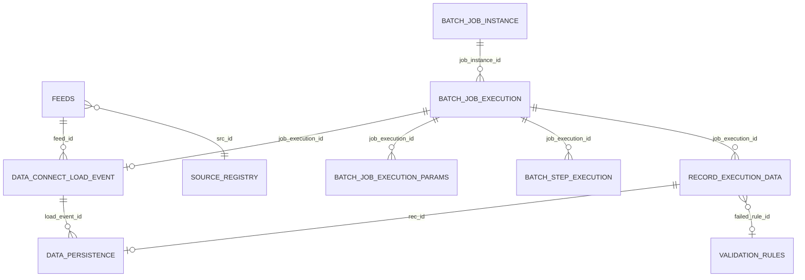

# Data model — lending file ingest (Spring Batch)

**Purpose:** Single **data model** reference for this sample: entities, relationships, and how they connect to **Spring Batch** and **S3**.  
**Detailed column types, constraints, and indexes:** [`consolidated-lending-ingest-sample-data.md`](./consolidated-lending-ingest-sample-data.md) **§0** (canonical PostgreSQL-oriented schema).  
**Example rows and walkthrough:** same file, **§1 onward** (sample ids like `DCE-60001` are illustrative).  
**Architecture context:** [`high-level-architecture/HLD-lending-batch-ingest.md`](./high-level-architecture/HLD-lending-batch-ingest.md) (§9 data model review).  
**Visualize (Mermaid Chart / [mermaid.ai](https://mermaid.ai/), Mermaid Live, VS Code):**  
- **Schema (ER):** [`DATA-MODEL-lending-ingest.mmd`](./DATA-MODEL-lending-ingest.mmd) — **one** `erDiagram` per file (required for tools that accept a single chart).  
- **Sample run:** [`DATA-MODEL-lending-ingest-sample.mmd`](./DATA-MODEL-lending-ingest-sample.mmd) — **one** `flowchart` for `lending-10rows-mixed-errors.psv` (same story as [`consolidated-lending-ingest-sample-data.md`](./consolidated-lending-ingest-sample-data.md)).  

Do **not** concatenate both diagrams in one paste: hosts such as [Mermaid Chart](https://mermaid.ai/) parse **one** diagram per diagram definition. Full tabular samples remain in the consolidated doc **§F / §G**.

---

## 1. Scope

| In scope | Out of scope |
|----------|----------------|
| Feed metadata (`FEEDS`, fields, schedules) | Production IAM / multi-tenant isolation policy |
| Load event per file (`DATA_CONNECT_LOAD_EVENT`) | Full DDL migration scripts (add per repo) |
| Spring Batch JDBC metadata (`BATCH_*`) | Duplicate custom job registry tables |
| Per-line validation outcomes (`RECORD_EXECUTION_DATA`) | Downstream warehouse star schema |
| Persisted valid business rows (`DATA_PERSISTENCE`) | Non-lending feeds (reuse pattern only) |
| Rules and LOVs (`VALIDATION_RULES`, `LIST_OF_VALUES`) | |

---

## 2. High-level relationships

One **file drop** in **S3** drives one **load event**, one **Spring Batch job execution**, many **line-level records**, and **one `DATA_PERSISTENCE` row per valid line** (for this lending sample).

**Notes:**

- **`BATCH_JOB_INSTANCE`** links to **`BATCH_JOB_EXECUTION`** (one instance → many executions only on restart/re-run semantics; typically one execution per successful file run in the sample).
- **`DATA_CONNECT_LOAD_EVENT.job_execution_id`** points at the **run** that processed that file.
- **`DATA_PERSISTENCE`** ties to both **load event** (business file boundary) and **line outcome** (`rec_id`).

---

## 3. Entity groups

### 3.1 Configuration & feed metadata (slow-changing)

| Table | Role |
|-------|------|
| `SOURCE_REGISTRY` | External partner / source system. |
| `SOURCE_SCHEDULE` | Cron or human-readable schedule; links to source. |
| `FEEDS` | Feed id, pattern, delimiter, link to source + schedule. Example: `FEED-LENDING-01`. |
| `FIELDS` / `FEED_FIELD_ASSOCIATION` | Column order, types, which field is **business key**. |
| `EXTERNAL_DATASOURCE_CONFIG` | Bucket/prefix for ingest. |
| `FRAMEWORK_CONFIGURATION` | Runtime knobs (e.g. `chunk.max_lines`). |

### 3.2 Orchestration & file boundary

| Table | Role |
|-------|------|
| `DATA_CONNECT_LOAD_EVENT` | **One row per file processed** (or per attempt, per your status rules): `feed_id`, `s3_key`, `status`, link to `job_execution_id`. |

### 3.3 Spring Batch (framework — standard schema)

| Table | Role |
|-------|------|
| `BATCH_JOB_INSTANCE` | Job definition + identifying parameters → stable instance. |
| `BATCH_JOB_EXECUTION` | Single run; status, times, exit code. |
| `BATCH_JOB_EXECUTION_PARAMS` | Auditable `JobParameters` (e.g. `loadEventId`, `s3Uri`, `feedId`, `runId`). |
| `BATCH_STEP_EXECUTION` | Per-step metrics (read/write/commit counts). |

Use **`schema-postgresql.sql`** from **`spring-batch-core`**; do not fork parallel metadata tables.

### 3.4 Validation catalog

| Table | Role |
|-------|------|
| `VALIDATION_RULES` | Rule id, expression / name for failed line reference. |
| `LIST_OF_VALUES` | Allowed values (e.g. currencies). |

### 3.5 Line-level & persisted business data

| Table | Role |
|-------|------|
| `RECORD_EXECUTION_DATA` | **One row per physical line** in the file for that job: `line_no`, `chunk_id`, `record_status`, errors. **Largest** table at scale. |
| `DATA_PERSISTENCE` | **Valid rows only**: business columns (`loan_id`, `amount`, `currency`) + lineage (`load_event_id`, `job_execution_id`, `rec_id`). |

### 3.6 Optional (extended design)

| Table | Role |
|-------|------|
| `CHUNK_MANIFEST` | Optional: `chunk_id`, line range, status — see consolidated **§0**. |
| `TEMP_OUT` | Hand-off staging to downstream. |
| `FRAMEWORK_AUDIT_LOG` | Supplementary audit rows. |

---

## 4. Cardinality (per successful file run)

| Relationship | Cardinality |
|--------------|-------------|
| `FEEDS` : `DATA_CONNECT_LOAD_EVENT` | 1 : many (over time) |
| `BATCH_JOB_EXECUTION` : `DATA_CONNECT_LOAD_EVENT` | 1 : 0..1 (design choice: usually **1:1** per run) |
| `BATCH_JOB_EXECUTION` : `RECORD_EXECUTION_DATA` | 1 : **L** (L = line count) |
| `BATCH_JOB_EXECUTION` : `DATA_PERSISTENCE` | 1 : **V** (V = valid line count ≤ L) |
| `RECORD_EXECUTION_DATA` : `DATA_PERSISTENCE` | 1 : 0..1 (invalid lines have **no** persistence row) |

---

## 5. Key attributes (logical)

| Entity | Natural / business keys | Surrogate PK (recommended) |
|--------|-------------------------|------------------------------|
| Load event | `(feed_id, s3_key, version)` semantics | `load_event_id` |
| Job execution | Spring-assigned | `JOB_EXECUTION_ID` |
| Line outcome | `(job_execution_id, line_no)` | `rec_id` |
| Persisted loan row | Policy-dependent; often `(load_event_id, loan_id)` for idempotency | `persistence_id` |

Full **PostgreSQL types**, **unique constraints**, and **index** suggestions: **[`consolidated-lending-ingest-sample-data.md`](./consolidated-lending-ingest-sample-data.md) §0**.

---

## 6. Data flow (logical)

S3 object → **`DATA_CONNECT_LOAD_EVENT`** (file accepted / tracking) → **Spring Batch** run → **`RECORD_EXECUTION_DATA`** (all lines) → **`DATA_PERSISTENCE`** (valid subset).

Diagram: [`high-level-architecture/diagrams/data-flow.mmd`](./high-level-architecture/diagrams/data-flow.mmd).

---

## 7. Related documents

| Document | Contents |
|----------|----------|
| [`consolidated-lending-ingest-sample-data.md`](./consolidated-lending-ingest-sample-data.md) | Canonical schema **§0**, sample tables **§1+**, join keys |
| [`high-level-architecture/HLD-lending-batch-ingest.md`](./high-level-architecture/HLD-lending-batch-ingest.md) | Partitioning, retention, idempotency, concurrency |
| [`brainstorm+rework-data-model-springbatch.md`](./brainstorm+rework-data-model-springbatch.md) | Broader brainstorm (if present) |

---

## 8. Changelog

| Version | Change |
|---------|--------|
| 1.0 | Initial data model doc; links to consolidated §0 and HLD |
