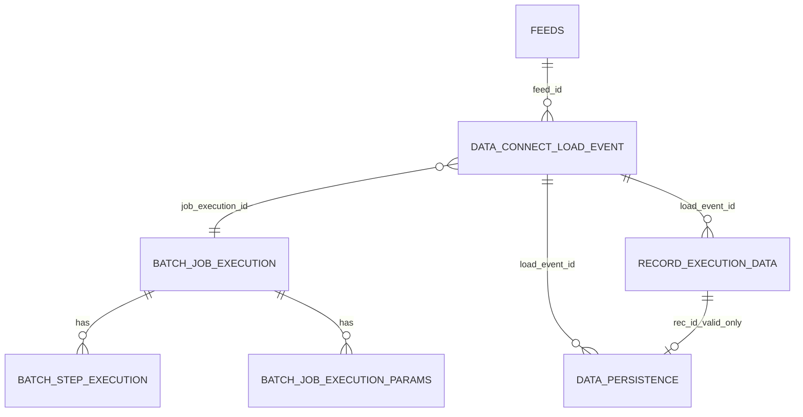

# Brainstorm: 10 rows → data model (Spring Batch)

**Primary file:** `samples/lending-10rows-mixed-errors.psv` — **10** data lines (no header), pipe-separated `loan_id|amount|currency`.

| Line | What’s wrong | Result |
|------|----------------|--------|
| 1–2, 4–7, 10 | Nothing — amounts and currencies OK | `VALID` → **`DATA_PERSISTENCE`** |
| 3 | Amount text **`not-a-number`** | `INVALID` — **`VR-AMT`** |
| 8 | Currency **`JPY`** (not in **USD,EUR,GBP**) | `INVALID` — **`VR-CCY`** |
| 9 | Amount **`0.00`** | `INVALID` — **`VR-AMT-GT0`** |

**Counts for this file:** **10** **`RECORD_EXECUTION_DATA`** rows, **7** **`DATA_PERSISTENCE`** rows, **3** rejects. Later sections repeat the same story with **`lending-10rows.psv`** (all valid) and a **second run** (Scenario B) with new ids.

Everything below is tied to this file unless it says otherwise. Broader relationships: **`DATA-MODEL-lending-ingest.md`**. **Implementation mapping**, **physical data model**, and **deeper data modeling** come **before** the long sample tables. Open design questions are at the **end**.

**Companion sample:** `lending-10rows.psv` (all lines valid).

**All tables + sample rows in one file:** `consolidated-lending-ingest-sample-data.md`.

---

## Spring Batch: principles

1. **`BATCH_JOB_*` / `BATCH_STEP_*`** hold run/step lifecycle and counts — **do not** mirror that in `FRAMEWORK_WORKFLOW_EXECUTION` / `FRAMEWORK_STAGE_EXECUTION` unless legacy reporting forces it.
2. **Domain tables** for what Batch does not model: feed metadata, **`DATA_CONNECT_LOAD_EVENT`**, **`RECORD_EXECUTION_DATA`**, **`DATA_PERSISTENCE`**.
3. Link domain rows with **`JOB_EXECUTION_ID`** (optional **`STEP_EXECUTION_ID`**).
4. **Chunks:** Spring Batch does not write **`JOB_CHUNK_*`**-style rows. For **`lending-10rows-mixed-errors.psv`**, store **`CHK-201`** (lines **1–5**) and **`CHK-202`** (lines **6–10**) on **`RECORD_EXECUTION_DATA`** only.
5. **Job → Step(s) → Chunk** is linear; DAGs live **outside** Batch.

---

## Narrative ids (labels in sample tables)

| Label | Spring Batch concept | Storage |
|-------|----------------------|---------|
| `WFEX-20001` (text) | One file run | `BATCH_JOB_EXECUTION.JOB_EXECUTION_ID` **20001** |
| `STGEX-201` … `203` | Steps | `BATCH_STEP_EXECUTION.STEP_EXECUTION_ID` **201**–**203** (or one step) |
| `CHK-201` / `202` | Logical half-file | Column on **`RECORD_EXECUTION_DATA`**; not a `BATCH_*` table |

---

**Assumptions**

- Feed **`FEED-LENDING-01`**, source **`SRC-PARTNER-01`**; chunk size **5** → logical halves lines 1–5 and 6–10.
- **Main example:** `lending-10rows-mixed-errors.psv` — **7** `VALID` / **3** `INVALID`; **`DATA_PERSISTENCE`:** 7 rows.
- **All-valid variant:** `lending-10rows.psv` → 10 persisted rows (see **All-valid variant** under **Ten rows**).
- **Second run:** `DCE-61001`, job exec **21001**, `REC-B*` (Scenario B near the end).

---

## Tables we use vs skip

**In this doc:** sample rows for catalog/metadata (`SOURCE_REGISTRY` through `FRAMEWORK_CONFIGURATION`), **`DATA_CONNECT_LOAD_EVENT`**, Spring **`BATCH_*`**, logical **`CHK-*`**, **`RECORD_EXECUTION_DATA`**, **`DATA_PERSISTENCE`**, optional **`TEMP_OUT`** and **`FRAMEWORK_AUDIT_LOG`**. Scenario B repeats load event + Batch + row samples with different ids.

**Skip (for this Spring Batch design):** parallel **`FRAMEWORK_*_EXECUTION`** tables — use **`BATCH_JOB_EXECUTION`** / **`BATCH_STEP_EXECUTION`** instead. Skip physical **`JOB_CHUNK_*`** tables unless you add a custom listener table; use logical **`chunk_id`** on **`RECORD_EXECUTION_DATA`**. Config **`*_AUDIT`** / **`*_TEMP`** tables track definition changes, **not** bad file lines.

**Rejects live in** **`RECORD_EXECUTION_DATA`** (and optionally **`FRAMEWORK_AUDIT_LOG`**). Invalid lines have **no** row in **`DATA_PERSISTENCE`**. This schema has **no** table literally named `REJECT` / `BAD_RECORDS`.

**Companion:** **`reference-10-rows-data-model.md`** is the full walkthrough (workflow execution, stage execution, chunk tables). This document keeps the **same business tables and row counts** but replaces only the **orchestration** layer with Spring Batch. The section below closes the gap so implementation is concrete, not hand-wavy.

---

## Implementation mapping: reference model → Spring Batch

### What stays the same as the reference walkthrough

- Same **sample files**, **10 lines**, **7** accepted / **3** rejected in the mixed file, same **`REC-*`**, **`DP-*`**, **`DCE-*`** story.
- Same **metadata** (`FEEDS`, **`VALIDATION_RULES`**, **`LIST_OF_VALUES`**, …), **`DATA_CONNECT_LOAD_EVENT`**, **`RECORD_EXECUTION_DATA`**, **`DATA_PERSISTENCE`**, optional **`TEMP_OUT`** / **`FRAMEWORK_AUDIT_LOG`**.
- **Only** the “who ran this file?” and “which stage/chunk?” **runtime** tables change: ERD **`FRAMEWORK_*_EXECUTION`** and **`JOB_CHUNK_*`** are **not** duplicated; **`BATCH_*`** is the source of truth for the run.

### Reference model → this design (quick map)

*(Full walkthrough with sample rows: **section 4** below.)*

| Reference concept | Spring Batch–aligned replacement |
|-------------------|----------------------------------|
| One workflow run (`WFEX-20001`) | **`BATCH_JOB_EXECUTION`** row; key = **`JOB_EXECUTION_ID`** |
| Stages (`STGEX-201`…`203`) | One **`Step`** each → **`BATCH_STEP_EXECUTION`**, *or* one **`Step`** with parse/validate/persist inside code |
| Chunk tables (`CHK-*` + `JOB_CHUNK_*`) | Batch **chunk size** = commit interval; **`CHK-*`** = **column** on **`RECORD_EXECUTION_DATA`** (lines 1–5 vs 6–10) |
| `wf_exec_id` on domain rows | **`job_execution_id`** FK → **`BATCH_JOB_EXECUTION`** |

### Runtime sequence — `lending-10rows-mixed-errors.psv`

1. **Create** **`DATA_CONNECT_LOAD_EVENT`** for `input/lending-10rows-mixed-errors.psv` (`RECEIVED` / `LOADING`); **`job_execution_id`** null until the job exists, then set.
2. **Build `JobParameters`**: **`loadEventId=DCE-60001`**, **`feedId=FEED-LENDING-01`**, **`s3Uri=s3://ingest-bucket/input/lending-10rows-mixed-errors.psv`**, plus a **run id** (timestamp or random) so this file is a new `JobInstance` — see **`BATCH_JOB_EXECUTION_PARAMS`** sample rows.
3. **`JobLauncher.run`** → **`BATCH_JOB_INSTANCE`** / **`BATCH_JOB_EXECUTION`**; capture **`JOB_EXECUTION_ID`** (example **20001**).
4. **UPDATE** **`DATA_CONNECT_LOAD_EVENT`** with **`job_execution_id=20001`**.
5. **`ItemReader`**: 10 reads — line 1 = `L-3001|125000.00|USD` … line 10 = `L-3010|50000.00|USD`; store **`line_no`** 1…10 on each item.
6. **`ItemProcessor`**: validate each line against **`VALIDATION_RULES`** / **`LOV-CCY-01`**; attach **`error_code`**, **`failed_rule_id`**, **`reason_or_error_message`** on lines **3, 8, 9**; leave valid lines clean.
7. **`ItemWriter`**: **`INSERT`** **10** **`RECORD_EXECUTION_DATA`** rows (always). **`INSERT`** **7** **`DATA_PERSISTENCE`** rows (lines **1, 2, 4, 5, 6, 7, 10** only — no DP for loan ids **L-3003, L-3008, L-3009**).
8. **`commit-interval=5`**: first commit after line **5** (chunk **`CHK-201`**), second after line **10** (**`CHK-202`**).
9. **End state**: Batch job **`COMPLETED`**; load event **`COMPLETED_WITH_ERRORS`** because three lines failed business rules (the job itself does not have to fail).

### Spring Batch components (who does what)

| Piece | Role in this model |
|-------|---------------------|
| **`Job`** | Named ingest job (e.g. `ingestLendingFileJob`). |
| **`Step`** | Chunked pipeline: reader → processor → writer. **Option A:** three steps (parse / validate / persist) — three **`BATCH_STEP_EXECUTION`** rows. **Option B (common):** one step — one **`BATCH_STEP_EXECUTION`** row; simpler metrics. |
| **`ItemReader`** | Streams lines; must expose **line number** for **`RECORD_EXECUTION_DATA`**. |
| **`ItemProcessor`** | Validation + business messages; returns something the writer can persist to **`RECORD_EXECUTION_DATA`**. |
| **`ItemWriter`** | Writes **domain** rows; **not** the `BATCH_*` tables (Batch writes those). |
| **`FaultTolerant` / skip** | For **`lending-10rows-mixed-errors.psv`**, this walkthrough **does not** use Batch skip for bad lines: lines **3, 8, 9** are **`INVALID`** in **`RECORD_EXECUTION_DATA`** and simply **omit** **`DATA_PERSISTENCE`**. |
| **`ChunkListener` / `StepListener`** | Only if you add **`FRAMEWORK_AUDIT_LOG`** lines or a custom **`ingest_chunk_progress`** table. |

### READ / WRITE / SKIP — single step, this file

After the job finishes processing **`lending-10rows-mixed-errors.psv`**:

- **`READ_COUNT` = 10** — one Item read per file line.
- **`WRITE_COUNT`** — whatever your `ItemWriter` reports as **written items** (often **10** if the writer commits **10** line outcomes). It is **not** the **7** **`DATA_PERSISTENCE`** rows unless your writer only emits persistence rows (then configure metrics accordingly).
- **`SKIP_COUNT` = 0** — invalid lines are **not** Spring Batch skips; they are normal writes to **`RECORD_EXECUTION_DATA`** with **`INVALID`**.

### Schema and version

- Apply the official **`schema-*.sql`** for **PostgreSQL** from the **`spring-batch-core`** JAR matching your Spring Batch version (`BATCH_JOB_INSTANCE`, `BATCH_JOB_EXECUTION`, `BATCH_JOB_EXECUTION_PARAMS`, `BATCH_STEP_EXECUTION`, execution context tables, etc.).

### Transactions

- For **`lending-10rows-mixed-errors.psv`** with **`commit-interval=5`**: first transaction commits **`REC-501`–`REC-505`** (chunk **`CHK-201`**); second commits **`REC-506`–`REC-510`** (**`CHK-202`**). **`DATA_PERSISTENCE`** inserts ride in the same transactions as the valid lines in each chunk.

---

## Physical data model (keys, FKs, columns to implement)

This section makes the model **less abstract**: what to create in DDL, how rows **join**, and **how many** rows per run. Names follow the samples above; **map to your deployment DDL** if columns differ.

### Cardinality (one file ingest = one `JOB_EXECUTION_ID` = one `load_event_id`)

| From | To | Ratio | Meaning |
|------|-----|--------|---------|
| `BATCH_JOB_INSTANCE` | `BATCH_JOB_EXECUTION` | 1 : N | Same job definition, many runs (each file = new execution). |
| `BATCH_JOB_EXECUTION` | `BATCH_STEP_EXECUTION` | 1 : N | One row per **Step** in the job (often 1 or 3). |
| `DATA_CONNECT_LOAD_EVENT` | `BATCH_JOB_EXECUTION` | 1 : 1 | **`job_execution_id`** links the business “file drop” to Batch’s run id. |
| `DATA_CONNECT_LOAD_EVENT` | `RECORD_EXECUTION_DATA` | 1 : N | Here **N = 10** (one row per physical line when you record every line). |
| `DATA_CONNECT_LOAD_EVENT` | `DATA_PERSISTENCE` | 1 : M | Here **M = 7** (valid lines only). **M ≤ N**. |
| `RECORD_EXECUTION_DATA` | `DATA_PERSISTENCE` | 1 : 0..1 | Valid line → optional **`rec_id`** on **`DATA_PERSISTENCE`**; invalid → **no** persistence row. |

### Join path (reporting / SQL you will actually write)

```text
DATA_CONNECT_LOAD_EVENT.load_event_id
    → DATA_CONNECT_LOAD_EVENT.job_execution_id = BATCH_JOB_EXECUTION.job_execution_id
        → BATCH_STEP_EXECUTION.job_execution_id (filter by STEP_NAME if multi-step)
RECORD_EXECUTION_DATA.job_execution_id = BATCH_JOB_EXECUTION.job_execution_id
DATA_PERSISTENCE.load_event_id = DATA_CONNECT_LOAD_EVENT.load_event_id
DATA_PERSISTENCE.rec_id → RECORD_EXECUTION_DATA.rec_id (which line produced this loan row)
```

### Suggested columns (domain tables — adjust types to your standard)

**`DATA_CONNECT_LOAD_EVENT`** (file instance)

| Column | Purpose |
|--------|---------|
| `load_event_id` | PK (e.g. `DCE-60001`). |
| `feed_id` | FK → `FEEDS.feed_id`. |
| `job_execution_id` | FK → `BATCH_JOB_EXECUTION.job_execution_id`; **nullable** until job starts, then **set**; or insert after job id is known — pick one lifecycle. |
| `s3_key`, `bucket` (optional) | Object location. |
| `status` | `RECEIVED` → `LOADING` → terminal (`COMPLETED_WITH_ERRORS`, …). |
| `etag`, `object_size`, `src_id` | Optional integrity / source. |
| `created_at`, `updated_at` | Audit. |

**`RECORD_EXECUTION_DATA`** (line-level outcome — **must** hold rejects)

| Column | Purpose |
|--------|---------|
| `rec_id` | PK. |
| `job_execution_id` | FK → `BATCH_JOB_EXECUTION` (**required** for join to Batch). |
| `load_event_id` | FK → `DATA_CONNECT_LOAD_EVENT` (optional if always joinable via job; **recommended** for queries by file). |
| `step_execution_id` | FK → `BATCH_STEP_EXECUTION` (**optional** — set if you attribute validation to a step). |
| `line_no` | 1…10 in sample; **required**. |
| `chunk_id` | Logical `CHK-*` (optional column; **not** a FK to `BATCH_*`). |
| `record_status` | `VALID` / `INVALID`. |
| `loan_id` | Business key from file (nullable if parse failed). |
| `error_code`, `failed_rule_id`, `reason_or_error_message` | Reject detail; **nullable** when `VALID`. |
| `raw_line` | Optional forensics. |

**Constraints (recommended):** `UNIQUE (job_execution_id, line_no)` so you cannot double-insert the same line for one run. Index `(job_execution_id)`, `(load_event_id)`.

**`DATA_PERSISTENCE`** (accepted domain rows only)

| Column | Purpose |
|--------|---------|
| `persistence_id` | PK. |
| `load_event_id` | FK → file instance. |
| `job_execution_id` | FK → Batch run (denormalized for filtering). |
| `loan_id`, `amount`, `currency` | Business payload. |
| `rec_id` | FK → **`RECORD_EXECUTION_DATA`** line that was accepted (traceability). |

**Constraints:** consider `UNIQUE (job_execution_id, loan_id)` or natural business key if re-runs must not duplicate loans.

**`FRAMEWORK_AUDIT_LOG`** (optional)

| Column | Purpose |
|--------|---------|
| `log_id` | PK. |
| `job_execution_id`, `load_event_id` | Correlate to run + file. |
| `step_execution_id` | Optional. |
| `severity`, `event_type`, `message`, `rec_id` | As in samples. |

### Spring Batch tables (framework — use official DDL)

Use the **`schema-postgresql.sql`** (or your DB) from **`spring-batch-core`**. Minimum for this story:

| Table | Role |
|-------|------|
| `BATCH_JOB_INSTANCE` | Stable job identity + job key. |
| `BATCH_JOB_EXECUTION` | **One row per run**; **`JOB_EXECUTION_ID`** = what you store on domain rows. |
| `BATCH_JOB_EXECUTION_PARAMS` | `loadEventId`, `feedId`, `s3Uri`, … |
| `BATCH_STEP_EXECUTION` | Per-step **`READ_COUNT` / `WRITE_COUNT` / `SKIP_COUNT`**, **`EXIT_CODE`**. |
| `BATCH_JOB_EXECUTION_CONTEXT` / `BATCH_STEP_EXECUTION_CONTEXT` | If you use execution context (optional). |

**FK:** `BATCH_STEP_EXECUTION.JOB_EXECUTION_ID` → `BATCH_JOB_EXECUTION.JOB_EXECUTION_ID`. Do **not** add FK from Batch tables **to** your domain schema — link **from** domain **to** Batch only.

### Gaps vs `reference-10-rows-data-model.md`

| Reference has | This Spring Batch design |
|---------------|---------------------------|
| `FRAMEWORK_WORKFLOW_EXECUTION` / `FRAMEWORK_STAGE_EXECUTION` rows | **`BATCH_JOB_EXECUTION` + `BATCH_STEP_EXECUTION`** only (no duplicate workflow tables). |
| `JOB_CHUNK_*` rows | **`chunk_id`** column + Batch chunk **commits**, or optional **`ingest_chunk_progress`**. |
| Same **`DATA_CONNECT_LOAD_EVENT`**, **`RECORD_EXECUTION_DATA`**, **`DATA_PERSISTENCE`** | Same **business** columns; add **`job_execution_id`** (and optional **`step_execution_id`**) everywhere you need to join to Batch. |

### Deeper data modeling (grounded in `lending-10rows-mixed-errors.psv`)

Cross-check with **`reference-10-rows-data-model.md`** (same **10** lines, **7** / **3** split) and **`DATA-MODEL-lending-ingest.md`**. Below lists **exact row counts** and join paths for that file; column types still come from your DDL.

#### Row counts — `lending-10rows-mixed-errors.psv`, first run (`JOB_EXECUTION_ID = 20001`)

Use this table to assert row counts in integration tests:

| Area | Table | Rows |
|------|--------|----------------|
| Spring Batch | `BATCH_JOB_INSTANCE` | 1 (new instance for this `JobParameters`) |
| | `BATCH_JOB_EXECUTION` | 1 |
| | `BATCH_JOB_EXECUTION_PARAMS` | **3** (`loadEventId`, `s3Uri`, `feedId` — see sample rows) |
| | `BATCH_STEP_EXECUTION` | **1** (single step) or **3** (parse / validate / persist) |
| Domain | `DATA_CONNECT_LOAD_EVENT` | **1** |
| | `RECORD_EXECUTION_DATA` | **10** (one per physical line, including invalid) |
| | `DATA_PERSISTENCE` | **7** (valid only) |
| | `TEMP_OUT` | **0–7** (only if you hand off) |
| | `FRAMEWORK_AUDIT_LOG` | **0** if you only use **`RECORD_EXECUTION_DATA`**; sample later shows **many** rows if you enable DB logging |

#### Bootstrap (once) vs runtime (every file)

| When | What you load |
|------|----------------|
| **Bootstrap / promotion** | `SOURCE_REGISTRY`, `SOURCE_SCHEDULE`, `FEEDS`, `FIELDS`, `FEED_FIELD_ASSOCIATION`, `LIST_OF_VALUES`, `VALIDATION_RULES`, `EXTERNAL_DATASOURCE_CONFIG`, `FRAMEWORK_CONFIGURATION` (+ optional host) — **no** per-line file data. |
| **Each ingest** | Spring creates **`BATCH_*`** rows; your app creates/updates **`DATA_CONNECT_LOAD_EVENT`**, then **`RECORD_EXECUTION_DATA`** (10×), **`DATA_PERSISTENCE`** (7× here), optional **`TEMP_OUT`** / **`FRAMEWORK_AUDIT_LOG`**. |

Invalid lines **never** insert into **`DATA_PERSISTENCE`**; they **always** get a **`RECORD_EXECUTION_DATA`** row if you follow this doc.

#### Metadata FKs the engine assumes (map to your DDL)

| From | To | Note |
|------|-----|------|
| `FEEDS` | `SOURCE_REGISTRY`, `SOURCE_SCHEDULE` | Who/when for the feed. |
| `FEED_FIELD_ASSOCIATION` | `FEEDS`, `FIELDS` | Column order for PSV. |
| `VALIDATION_RULES` | `LIST_OF_VALUES` (logical) | Rule **`VR-CCY`** uses **`lov_id`** **`LOV-CCY-01`** in the expression — enforce in app or add **`lov_id`** column + FK if you want DB-enforced LOV refs. |
| `DATA_CONNECT_LOAD_EVENT` | `FEEDS` | `feed_id` for this file. |
| Domain rows | `BATCH_JOB_EXECUTION` | `job_execution_id` → **`JOB_EXECUTION_ID`**. |

#### Suggested insert order (runtime, happy path)

1. Insert **`DATA_CONNECT_LOAD_EVENT`** (status `RECEIVED` / `LOADING`; `job_execution_id` nullable or deferred).
2. `JobLauncher.run` → Batch writes **`BATCH_JOB_INSTANCE`**, **`BATCH_JOB_EXECUTION`**, **`BATCH_JOB_EXECUTION_PARAMS`**, **`BATCH_STEP_EXECUTION`** as steps run.
3. **Update** load event with **`job_execution_id`**.
4. For each line in the writer: **`INSERT RECORD_EXECUTION_DATA`**; if valid, **`INSERT DATA_PERSISTENCE`** (same chunk transaction as your `commit-interval`).
5. Optional: **`TEMP_OUT`**, **`FRAMEWORK_AUDIT_LOG`**.

#### `TEMP_OUT` — columns to add if the model only names the table

Often 1:1 with accepted **`DATA_PERSISTENCE`** rows:

| Column | Purpose |
|--------|---------|
| `temp_out_id` | PK. |
| `persistence_id` | FK → **`DATA_PERSISTENCE`** (which good row is handed off). |
| `load_event_id` / `job_execution_id` | Filter by file/run (denormalized OK). |
| `handoff_status`, `target_system`, `sent_at` | Optional pipeline state. |

#### Core relationships (domain + Batch)



*(Logical diagram — add `FEEDS` → metadata chain as in **Metadata** section.)*

#### What is still “your DDL”

- **Precision/scale** for `amount`, **varchar** lengths, **timestamp** TZ, **soft-delete** flags on metadata.
- Whether **`failed_rule_id`** is FK → `VALIDATION_RULES.ID` or free text.
- Whether **`chunk_id`** is `VARCHAR` or FK to a small reference table (this doc treats **`CHK-*`** as labels).

---

## 1. Metadata already in DB

Metadata for **`FEED-LENDING-01`**, source **`SRC-PARTNER-01`**, **`chunk.max_lines=5`** so **`lending-10rows-mixed-errors.psv`** splits into lines **1–5** and **6–10**. Column names match the samples in this doc; align types to your DDL.

**No rows from the PSV file** appear here — only definitions that must exist **before** you process **`lending-10rows-mixed-errors.psv`**.

---

### `SOURCE_REGISTRY`

| src_id | src_name | status |
|--------|----------|--------|
| SRC-PARTNER-01 | Synthetic Example Source | ACTIVE |

---

### `SOURCE_SCHEDULE`

| schedule_id | src_id | cron_or_desc |
|-------------|--------|----------------|
| SCH-DAILY-01 | SRC-PARTNER-01 | Daily 02:00 UTC |

---

### `FEEDS`

| feed_id | feed_name | src_id | schedule_id | file_pattern | delimiter |
|---------|-----------|--------|---------------|--------------|-----------|
| FEED-LENDING-01 | lending | SRC-PARTNER-01 | SCH-DAILY-01 | lending*.psv | \| |

*Objects such as `input/lending-10rows.psv` or `input/lending-10rows-mixed-errors.psv` match `lending*.psv`.*

---

### `FIELDS` (global catalog; fields reusable across feeds)

| field_id | field_name | data_type | max_len |
|----------|------------|-----------|---------|
| FLD-LOAN-ID | loan_id | STRING | 32 |
| FLD-AMT | amount | DECIMAL | 18 |
| FLD-CCY | currency | STRING | 3 |

---

### `FEED_FIELD_ASSOCIATION` (column order in PSV)

| feed_id | field_id | field_sequence | business_key |
|---------|----------|----------------|--------------|
| FEED-LENDING-01 | FLD-LOAN-ID | 1 | Y |
| FEED-LENDING-01 | FLD-AMT | 2 | N |
| FEED-LENDING-01 | FLD-CCY | 3 | N |

---

### `LIST_OF_VALUES`

| lov_id | name | values |
|--------|------|--------|
| LOV-CCY-01 | ISO_CURRENCY | USD,EUR,GBP |

**How it is used:** the validation rule **`VR-CCY`** (next table) references **`lov_id` `LOV-CCY-01`** in its expression — e.g. `in(field(currency), LOV-CCY-01)`. The engine resolves that id to this row’s **values** when evaluating each line. **Line 8** of `lending-10rows-mixed-errors.psv` is **`JPY`**, which is not in this list → rule fails → **`RECORD_EXECUTION_DATA`** shows **`failed_rule_id` = `VR-CCY`** for `REC-508`.

---

### `VALIDATION_RULES`

| ID | NAME | DESCR | EXPRESSION | SOURCE |
|----|------|-------|------------|--------|
| VR-LOAN-ID | loan_id_present | Loan id required, non-blank | notBlank(field(loan_id)) | ENGINE |
| VR-LOAN-FMT | loan_id_format | Loan id matches L-####### pattern | matches(field(loan_id), '^L-\\d{4}$') | ENGINE |
| VR-AMT | amount_numeric | Amount must parse as decimal | matches(field(amount), DECIMAL) | ENGINE |
| VR-AMT-GT0 | amount_positive | Amount strictly greater than zero | gt(field(amount), 0) | ENGINE |
| VR-CCY | currency_lov | Currency in approved list | in(field(currency), LOV-CCY-01) | ENGINE |

*(Same rule rows appear again under Rules, with runtime notes.)*

---

### `EXTERNAL_DATASOURCE_CONFIG`

| config_id | bucket_or_root | prefix |
|-----------|----------------|--------|
| EXT-INGEST-01 | ingest-bucket | input/ |

*Resolves to `s3://ingest-bucket/input/lending-10rows-mixed-errors.psv` for the main example run.*

---

### `FRAMEWORK_CONFIGURATION`

| config_key | config_value |
|------------|----------------|
| chunk.max_lines | 5 |

*Ten lines → chunks `CHK-201` (lines 1–5) and `CHK-202` (lines 6–10).*

---

### Optional: `FRAMEWORK_CONFIG_HOST` (if your schema ties env to host)

| host_id | env_name | notes |
|---------|----------|--------|
| FCH-01 | BATCH-ECS-01 | Illustrative processing host for framework jobs |

*Omit if not used in your build.*

---

## 2. What sits in S3 (not in DB)

| Object | Value |
|--------|--------|
| Bucket / key | `s3://ingest-bucket/input/lending-10rows-mixed-errors.psv` |
| Lines | 10 (each = one business record; **3** lines fail validation — see ten-row results below) |

---

## 3. Load event: `DATA_CONNECT_LOAD_EVENT`

One row for **this** drop. After **`JobLauncher.run`**, persist **`JOB_EXECUTION_ID`** (single FK to Batch is enough; **`wf_exec_id`** column is **not** needed if you drop legacy naming).

| load_event_id | job_execution_id | feed_id | s3_key | status | notes |
|---------------|------------------|---------|--------|--------|--------|
| `DCE-60001` | **20001** | `FEED-LENDING-01` | `input/lending-10rows-mixed-errors.psv` | `RECEIVED` → `LOADING` → **`COMPLETED_WITH_ERRORS`** | `etag`, `src_id`; **`20001`** = `BATCH_JOB_EXECUTION.JOB_EXECUTION_ID` |

**Insert order:** insert load event with **`job_execution_id` NULL** → launch job → **UPDATE** with **`JOB_EXECUTION_ID`**, or **insert** `BATCH_JOB_EXECUTION` first if you pre-allocate ids in one transaction.

---

## 4. Spring Batch run (`BATCH_*`) — same story as **reference** chapter 4, different tables

You already know **`reference-10-rows-data-model.md`** chapter **3** (load event) and chapter **4** (one workflow run + three stages + chunks). **Nothing changes in the business outcome** (same file, same 10 lines, same **`DCE-60001`**). Only **where the “run” and “stages” are stored** changes: Spring Batch uses **`BATCH_*`** instead of **`FRAMEWORK_WORKFLOW_EXECUTION`** / **`FRAMEWORK_STAGE_EXECUTION`**.

### Reference → Spring Batch (one-to-one ideas)

| You know (reference doc) | Spring Batch stores it in |
|--------------------------|---------------------------|
| **`FRAMEWORK_WORKFLOW_EXECUTION`** — one row **`WFEX-20001`** = this file run | **`BATCH_JOB_EXECUTION`** — one row **`JOB_EXECUTION_ID = 20001`** = this file run |
| **`FRAMEWORK_STAGE_EXECUTION`** — three rows **`STGEX-201`…`203`** (parse → validate → persist) | **`BATCH_STEP_EXECUTION`** — **three rows** if you define **three Steps** in Java/XML, **or one row** if you use **one Step** that does everything |
| Link from domain rows: **`wf_exec_id`** | Same link: **`job_execution_id`** → **`20001`** |
| **`workflow_id`** (`WF-INGEST-01`) | **`BATCH_JOB_INSTANCE`** holds the stable **job name / key** (Spring’s “which job definition”) |
| *(reference has no separate “params” table for the file)* | **`BATCH_JOB_EXECUTION_PARAMS`** — Spring copies **`loadEventId`**, **`s3Uri`**, **`feedId`** so the run is self-describing in Batch’s own tables |

You **do not** create **`FRAMEWORK_WORKFLOW_EXECUTION`** / **`FRAMEWORK_STAGE_EXECUTION`** rows **and** duplicate Spring Batch — for a greenfield ingest, **`BATCH_*`** is enough. Keep **`DATA_CONNECT_LOAD_EVENT`**, **`RECORD_EXECUTION_DATA`**, **`DATA_PERSISTENCE`** exactly as in the reference; only swap the orchestration FK from **`wf_exec_id`** to **`job_execution_id`**.

### Extra Spring tables (why they exist)

- **`BATCH_JOB_INSTANCE`** — “which job” (like knowing **`WF-INGEST-01`**, but Batch also needs a **technical job key** for restarts). One instance links to many executions over time.
- **`BATCH_JOB_EXECUTION_PARAMS`** — key/value copies of what you passed to **`JobLauncher.run`** (which file, which load event id). Handy for ops without joining only to your schema.
- **`BATCH_JOB_EXECUTION_CONTEXT`** / **`BATCH_STEP_EXECUTION_CONTEXT`** — not detailed in this walkthrough; Spring may store small serialized state between chunks. Apply the official **`schema-*.sql`** from your Spring Batch version.

### Part A — One run (replaces reference **`FRAMEWORK_WORKFLOW_EXECUTION`**)

Same meaning as **`WFEX-20001`** | **`DCE-60001`** | **`COMPLETED_WITH_ERRORS`**.

| JOB_EXECUTION_ID | JOB_INSTANCE_ID | STATUS | EXIT_CODE |
|------------------|-----------------|--------|-----------|
| **20001** | (links to instance) | `COMPLETED` | `COMPLETED` |

**Note:** In the real JDBC schema, **read/write/skip counts are not on this row** — they are on **`BATCH_STEP_EXECUTION`** below.

### Part B — Stages (replaces reference **`FRAMEWORK_STAGE_EXECUTION`**)

**Option A — three Steps** (same shape as reference **`STGEX-201`**, **`STGEX-202`**, **`STGEX-203`**):

| STEP_EXECUTION_ID | JOB_EXECUTION_ID | STEP_NAME (your choice) | STATUS | READ_COUNT | WRITE_COUNT | SKIP |
|-------------------|------------------|-------------------------|--------|------------|-------------|-----|
| **201** | 20001 | `parseInputStep` | `COMPLETED` | 10 | 10 | 0 |
| **202** | 20001 | `validateStep` | `COMPLETED` | 10 | 10 | 0 |
| **203** | 20001 | `persistStep` | `COMPLETED` | 10 | 7 | 0 |

**Option B — one Step** (one row instead of three; all logic inside a single reader/processor/writer):

| STEP_EXECUTION_ID | JOB_EXECUTION_ID | STEP_NAME | STATUS | READ_COUNT | WRITE_COUNT | SKIP_COUNT |
|-------------------|------------------|-----------|--------|------------|-------------|------------|
| **250** | 20001 | `ingestLendingFileStep` | `COMPLETED` | **10** | **10** | **0** |

Lines **3, 8, 9** are **`INVALID`** in **`RECORD_EXECUTION_DATA`**, not Batch **skips**, so **`SKIP_COUNT=0`**. **`WRITE_COUNT=10`** if the writer counts **10** line outcomes; use **7** only if your code counts only **`DATA_PERSISTENCE`** writes — pick one rule.

### Part C — Parameters (extra vs reference; Spring-specific)

| JOB_EXECUTION_ID | KEY_NAME | TYPE | STRING_VAL |
|------------------|----------|------|------------|
| 20001 | `loadEventId` | STRING | `DCE-60001` |
| 20001 | `s3Uri` | STRING | `s3://ingest-bucket/input/lending-10rows-mixed-errors.psv` |
| 20001 | `feedId` | STRING | `FEED-LENDING-01` |

### Trace (same as reference)

```text
DCE-60001 (load event)
    → JOB_EXECUTION_ID 20001 (BATCH_JOB_EXECUTION)   ← was WFEX-20001
        → BATCH_STEP_EXECUTION (×1 or ×3)             ← was STGEX-201…203
        → REC-501…REC-510, DP-601…DP-607               ← unchanged vs reference
```

---

## 5. Chunks (logical)

Spring Batch **does not** create **`JOB_CHUNK_EXECUTION_STATUS`** rows. For **`lending-10rows-mixed-errors.psv`** with **`chunk.max_lines=5`** and **`commit-interval=5`**:

1. **Chunk 1** — file lines **1–5** (includes the bad line **3**); logical id **`CHK-201`** on **`RECORD_EXECUTION_DATA`**.
2. **Chunk 2** — file lines **6–10** (includes bad lines **8** and **9**); logical id **`CHK-202`**.

**This doc uses option 3:** store **`CHK-201` / `CHK-202`** only on **`RECORD_EXECUTION_DATA`** (not a separate `BATCH_*` chunk table). Alternatives: execution-context JSON after each commit, or a custom **`ingest_chunk_progress`** table from **`ChunkListener.afterChunk`** — only if you need extra telemetry beyond **`BATCH_STEP_EXECUTION`**.

| chunk_id (logical) | job_execution_id | line_from | line_to | notes |
|--------------------|------------------|-----------|---------|--------|
| `CHK-201` | 20001 | 1 | 5 | Lines 1–5 (first half of file) |
| `CHK-202` | 20001 | 6 | 10 | |

---

## 6. Ten rows: `RECORD_EXECUTION_DATA`

One row **per physical line** (10 rows). Source file: **`lending-10rows-mixed-errors.psv`**.

**Spring Batch:** add **`JOB_EXECUTION_ID`** (FK to **`BATCH_JOB_EXECUTION`**) on every row; optional **`STEP_EXECUTION_ID`** if you attribute validation to a specific step. Legacy column **`wf_exec_id`** in older docs ≈ same logical join as **`job_execution_id`**.

**Recommended columns for auditing:** **`error_code`**, **`failed_rule_id`**, **`reason_or_error_message`**. Your DDL might use `error_message` instead of `reason_or_error_message`.

### Mixed valid / invalid (primary example)

| rec_id | job_execution_id | line_no | chunk_id | loan_id | record_status | error_code | failed_rule_id | reason_or_error_message |
|--------|------------------|---------|----------|---------|---------------|------------|----------------|-------------------------|
| `REC-501` | **20001** | 1 | `CHK-201` | L-3001 | `VALID` | — | — | — |
| `REC-502` | **20001** | 2 | `CHK-201` | L-3002 | `VALID` | — | — | — |
| `REC-503` | **20001** | 3 | `CHK-201` | L-3003 | `INVALID` | `VAL_NUMERIC` | `VR-AMT` | Amount field cannot be parsed as a decimal number (value: not-a-number). |
| `REC-504` | **20001** | 4 | `CHK-201` | L-3004 | `VALID` | — | — | — |
| `REC-505` | **20001** | 5 | `CHK-201` | L-3005 | `VALID` | — | — | — |
| `REC-506` | **20001** | 6 | `CHK-202` | L-3006 | `VALID` | — | — | — |
| `REC-507` | **20001** | 7 | `CHK-202` | L-3007 | `VALID` | — | — | — |
| `REC-508` | **20001** | 8 | `CHK-202` | L-3008 | `INVALID` | `VAL_LOV` | `VR-CCY` | Currency code JPY is not in the allowed list (USD, EUR, GBP). |
| `REC-509` | **20001** | 9 | `CHK-202` | L-3009 | `INVALID` | `VAL_RANGE` | `VR-AMT-GT0` | Amount must be strictly greater than zero. |
| `REC-510` | **20001** | 10 | `CHK-202` | L-3010 | `VALID` | — | — | — |

**Trace:** all rows reference **`JOB_EXECUTION_ID = 20001`**; lines 1–5 → **`CHK-201`**, lines 6–10 → **`CHK-202`**. **Invalid** lines still get a **`RECORD_EXECUTION_DATA`** row.

### All-valid variant (file `lending-10rows.psv`)

If every line passes: all **`record_status` = `VALID`**, and **`error_code` / `failed_rule_id` / `reason_or_error_message`** are null or `—` for every row. Then **`DATA_PERSISTENCE`** contains **10** rows (one per line). The **Persisted rows** section below shows the **mixed** case (**7** persisted rows).

---

## 7. Rules (`VALIDATION_RULES` / `LIST_OF_VALUES`)

**`LIST_OF_VALUES` and `VALIDATION_RULES`:** rules that check a “value must be in a set” point at a **`lov_id`** (here **`LOV-CCY-01`** for **`VR-CCY`**). Same **`lov_id`** appears in **`LIST_OF_VALUES`** in **Metadata** above; runtime evaluation does not insert into either table.

**What “no new inserts during the run” means:** While processing the ingest file (e.g. `lending-10rows-mixed-errors.psv`), the job **does not add rows** to `VALIDATION_RULES`. The rows below are **pre-seeded** (same logical content as in **Metadata** above). At runtime the engine **SELECT**s these rules and evaluates them **per line** — it does **not** `INSERT` into `VALIDATION_RULES` for each line or each failure.

*(Oracle-style rule metadata UIs often label columns `ID`, `DESCR`, `NAME`, `EXPRESSION`, `SOURCE` — map `rule_id` → `ID`, `descr` → `DESCR`, etc.)*

### `LIST_OF_VALUES` — sample data

| lov_id | name | values |
|--------|------|--------|
| LOV-CCY-01 | ISO_CURRENCY | USD,EUR,GBP |

*Duplicate of **Metadata** for the rules discussion; **`VR-CCY`** references **`LOV-CCY-01`**.*

---

### `VALIDATION_RULES` — sample data (metadata; not mutated during ingest)

| ID | NAME | DESCR | EXPRESSION | SOURCE |
|----|------|-------|------------|--------|
| VR-LOAN-ID | loan_id_present | Loan id required, non-blank | notBlank(field(loan_id)) | ENGINE |
| VR-LOAN-FMT | loan_id_format | Loan id matches L-####### pattern | matches(field(loan_id), '^L-\\d{4}$') | ENGINE |
| VR-AMT | amount_numeric | Amount must parse as decimal | matches(field(amount), DECIMAL) | ENGINE |
| VR-AMT-GT0 | amount_positive | Amount strictly greater than zero | gt(field(amount), 0) | ENGINE |
| VR-CCY | currency_lov | Currency in approved list | in(field(currency), LOV-CCY-01) | ENGINE |

---

### Runtime (not stored in `VALIDATION_RULES`) — example evaluation for **line 1** (`L-3001|125000.00|USD`)

| Rule ID | Result | Notes |
|---------|--------|--------|
| VR-LOAN-ID | PASS | `L-3001` present |
| VR-LOAN-FMT | PASS | matches pattern (adjust regex if your real ids differ) |
| VR-AMT | PASS | numeric |
| VR-AMT-GT0 | PASS | 125000.00 > 0 |
| VR-CCY | PASS | USD ∈ LOV |

Same checks repeat for each line; **outcomes** land in **`RECORD_EXECUTION_DATA`** (`VALID` / `INVALID` + **`reason_or_error_message`**), not as new rows in **`VALIDATION_RULES`**.

---

## 8. Persisted rows: `DATA_PERSISTENCE`

One row per **`VALID`** record only. For **`lending-10rows-mixed-errors.psv`**, **7** rows (lines **3, 8, 9** have no persistence row).

| persistence_id | load_event_id | job_execution_id | loan_id | amount | currency | rec_id |
|----------------|----------------|-------------------|---------|--------|----------|--------|
| `DP-601` | `DCE-60001` | **20001** | L-3001 | 125000.00 | USD | `REC-501` |
| `DP-602` | `DCE-60001` | **20001** | L-3002 | 98000.50 | USD | `REC-502` |
| `DP-603` | `DCE-60001` | **20001** | L-3004 | 77000.00 | USD | `REC-504` |
| `DP-604` | `DCE-60001` | **20001** | L-3005 | 210000.00 | USD | `REC-505` |
| `DP-605` | `DCE-60001` | **20001** | L-3006 | 333000.75 | USD | `REC-506` |
| `DP-606` | `DCE-60001` | **20001** | L-3007 | 15000.00 | GBP | `REC-507` |
| `DP-607` | `DCE-60001` | **20001** | L-3010 | 50000.00 | USD | `REC-510` |

*No `DP-*` for `L-3003`, `L-3008`, `L-3009` — those loans failed validation (see mixed table above).*

---

## 9. Optional `TEMP_OUT`

Up to **7** rows pointing at `DP-601`–`DP-607` for downstream export (only **accepted** rows).

---

## 10. End-to-end ID chain (10-line file, 7 persisted)

```text
DCE-60001 (DATA_CONNECT_LOAD_EVENT)
    ← JOB_EXECUTION_ID 20001 (BATCH_JOB_EXECUTION)
            ├── BATCH_STEP_EXECUTION(s) — step(s) with READ/WRITE/SKIP counts
            ├── CHK-201 / CHK-202 — logical chunk ids on RECORD_EXECUTION_DATA only (optional)
            ├── REC-501 … REC-510 — 10 rows; job_execution_id=20001; 7 VALID, 3 INVALID
            └── DP-601 … DP-607 — 7 domain rows; job_execution_id=20001
```

---

## 11. Other invalid-line examples (summary)

The mixed example above already shows **three** invalid lines (3, 8, 9) with **`error_code`**, **`failed_rule_id`**, and **`reason_or_error_message`**. For a single bad line elsewhere (e.g. line 7 bad amount):

- **`RECORD_EXECUTION_DATA`:** that line → `INVALID` + codes + reason (row-level detail below).
- **`DATA_PERSISTENCE`:** no row for that loan. The **job** still completes unless you use fail-fast; invalid lines are reflected in **`RECORD_EXECUTION_DATA`**, not in `BATCH_*` chunk rows (this doc uses logical **`CHK-*`** only).

Where errors surface by table: **Where error data goes** (next major section).

---

## 12. Where error data goes (schema overview)

This model lists many tables. There is **no** table literally named `ERROR` or `REJECT`. For **`lending-10rows-mixed-errors.psv`**, the three bad lines (**3, 8, 9**) show up in **`RECORD_EXECUTION_DATA`** as **`INVALID`**; **`FRAMEWORK_AUDIT_LOG`** is extra if you write it; **`BATCH_*`** shows job/step success unless the process crashes:

### Row-level (most important for “bad lines”)

**`RECORD_EXECUTION_DATA`** — one row per physical line; for failures, **status** = `INVALID` (or equivalent) **instead of** inserting into **`DATA_PERSISTENCE`**.

Illustrative columns (names vary by DDL):

| Column idea | Example for failed line 3 (mixed example) |
|---------------|---------------------------|
| `rec_id` | `REC-503` |
| `job_execution_id` | **20001** |
| `line_no` | `3` |
| `chunk_id` | `CHK-201` |
| `loan_id` | `L-3003` (if parseable) or null |
| `record_status` | `INVALID` |
| `error_code` | `VAL_NUMERIC` |
| `failed_rule_id` | `VR-AMT` |
| `reason_or_error_message` | Human-readable text (lines 3, 8, 9 in the mixed example) |
| `raw_line` / `payload` | Optional duplicate of bad line for forensics |

**`DATA_PERSISTENCE`** — **no row** for that loan/line when validation failed.

### Framework / runtime log (errors, warnings, trace)

**`FRAMEWORK_AUDIT_LOG`** — not required for the lending file: lines **3, 8, 9** are already **`INVALID`** in **`RECORD_EXECUTION_DATA`**. If you add DB logs, tie them to **`job_execution_id`** / **`load_event_id`** and optionally **`STEP_EXECUTION_ID`**.

**Example log lines for this run (`JOB_EXECUTION_ID = 20001`, `DCE-60001`, same three bad lines as in **`RECORD_EXECUTION_DATA`**):**

| log_id | job_execution_id | load_event_id | step_execution_id (opt) | chunk_id (opt) | severity | event_type | message | rec_id |
|--------|------------------|---------------|-------------------------|----------------|----------|------------|---------|--------|
| `LOG-9000` | **20001** | `DCE-60001` | — | — | `INFO` | `RUN_STARTED` | Job started; feed=FEED-LENDING-01 | — |
| `LOG-9001` | **20001** | `DCE-60001` | **201** | — | `INFO` | `STEP_STARTED` | Step parseInputStep | — |
| `LOG-9002` | **20001** | `DCE-60001` | **201** | — | `INFO` | `STEP_COMPLETED` | Parse completed; lines read=10 | — |
| `LOG-9003` | **20001** | `DCE-60001` | **202** | — | `INFO` | `STEP_STARTED` | Step validateStep | — |
| `LOG-9004` | **20001** | `DCE-60001` | **202** | `CHK-201` | `DEBUG` | `CHUNK_PROGRESS` | Validating chunk lines 1–5 | — |
| `LOG-9005` | **20001** | `DCE-60001` | **202** | `CHK-202` | `DEBUG` | `CHUNK_PROGRESS` | Validating chunk lines 6–10 | — |
| `LOG-9006` | **20001** | `DCE-60001` | **202** | — | `ERROR` | `ROW_VALIDATION` | Line 3: amount not numeric (rule VR-AMT) | `REC-503` |
| `LOG-9006b` | **20001** | `DCE-60001` | **202** | — | `ERROR` | `ROW_VALIDATION` | Line 8: currency JPY not in LOV (rule VR-CCY) | `REC-508` |
| `LOG-9006c` | **20001** | `DCE-60001` | **202** | — | `ERROR` | `ROW_VALIDATION` | Line 9: amount must be &gt; 0 (rule VR-AMT-GT0) | `REC-509` |
| `LOG-9007` | **20001** | `DCE-60001` | **202** | — | `WARN` | `THRESHOLD` | Reject count 3 below configured max_errors; continuing | — |
| `LOG-9008` | **20001** | `DCE-60001` | **202** | — | `INFO` | `STEP_COMPLETED` | Validate completed; valid=7, invalid=3 | — |
| `LOG-9009` | **20001** | `DCE-60001` | **203** | — | `INFO` | `STEP_STARTED` | Step persistStep | — |
| `LOG-9010` | **20001** | `DCE-60001` | **203** | — | `ERROR` | `PERSIST_BATCH` | (Example) Batch insert retry 1/3 — transient DB timeout | — |
| `LOG-9011` | **20001** | `DCE-60001` | **203** | — | `INFO` | `STEP_COMPLETED` | Persist completed; rows written=7 | — |
| `LOG-9012` | **20001** | `DCE-60001` | — | — | `INFO` | `JOB_COMPLETED` | Exit COMPLETED_WITH_ERRORS (or COMPLETED if all valid) | — |
| `LOG-9013` | **20001** | `DCE-60001` | **202** | — | `ERROR` | `VALIDATION_ENGINE` | (Rare) Expression parse error for rule VR-XYZ | — |

**Narrower example** (light logging):

| log_id | job_execution_id | load_event_id | severity | event_type | message | rec_id |
|--------|------------------|---------------|----------|------------|---------|--------|
| `LOG-9101` | **20001** | `DCE-60001` | `ERROR` | `ROW_VALIDATION` | Line 3: amount not numeric | `REC-503` |
| `LOG-9102` | **20001** | `DCE-60001` | `INFO` | `ROW_SKIPPED` | Invalid row not persisted | `REC-503` |

*If `FRAMEWORK_AUDIT_LOG` is empty in your DB, the product might log only to `RECORD_EXECUTION_DATA` or to files — confirm usage.*

### File-level

**`DATA_CONNECT_LOAD_EVENT`** — for **`lending-10rows-mixed-errors.psv`**, terminal status **`COMPLETED_WITH_ERRORS`** with **7** accepted / **3** rejected in **`RECORD_EXECUTION_DATA`**. Use **`FAILED`** only when the file cannot be read or the job aborts before finishing all **10** lines.

### Run / step / chunk level (Spring Batch)

| Table | When it shows “error” |
|-------|------------------------|
| **`BATCH_JOB_EXECUTION`** | Job `status` / `exit_code` reflect failure if the run aborts. |
| **`BATCH_STEP_EXECUTION`** | e.g. persist step `exit_code` = failed if that step blows up. |
| **Custom chunk / listener table** (optional) | Only if you add one — e.g. chunk rolled back or aborted per policy. |

These describe **processing** health, not the **payload** of bad rows (payload lives in **`RECORD_EXECUTION_DATA`** / log). *Legacy docs used **`FRAMEWORK_*_EXECUTION`** / **`JOB_CHUNK_*`** for the same idea.*

### What is *not* the “bad data” table

| Pattern | Why |
|---------|-----|
| **`FEEDS_AUDIT`, `FRAMEWORK_STAGE_AUDIT`, `VALIDATION_RULES_AUDIT`, …** | Almost always **who changed which config** and when — **not** rejected file rows. |
| **`FEEDS_TEMP`, `FRAMEWORK_WORKFLOW_TEMP`, …** | **Draft** definitions, not runtime rejects. |
| **`TEMP_OUT`** | Staging for **accepted** handoff — not the primary reject store. |

### End-to-end error chain (same 10-line file — lines 3, 8, 9 invalid)

```text
DCE-60001 (load event — COMPLETED_WITH_ERRORS)
    ← JOB_EXECUTION_ID 20001 (BATCH_JOB_EXECUTION)
            ├── BATCH_STEP_EXECUTION(s) — completed with READ/WRITE/SKIP
            ├── RECORD_EXECUTION_DATA: REC-503, REC-508, REC-509 = INVALID (+ reason_or_error_message)
            ├── FRAMEWORK_AUDIT_LOG or app logs (optional)
            └── DATA_PERSISTENCE: 7 rows (no DP for L-3003, L-3008, L-3009)
```

---

## 13. Scenario B — Second run (same file shape, different ids)

Same **metadata** as in **Metadata already in DB**. Same row-level pattern as the mixed example (7 valid / 3 invalid). **Different** **`load_event_id`**, **`JOB_EXECUTION_ID`**, **`rec_id`** (`DCE-61001`, **21001**, `REC-B*`) so examples do not collide with the **first run** (`DCE-60001`, **20001**, `REC-501`…).

### File in S3 (Scenario B)

| Object | Value |
|--------|--------|
| Sample file | `samples/lending-10rows-mixed-errors.psv` |
| S3 key | `input/lending-10rows-mixed-errors.psv` |

**Contents (10 lines)** — see `lending-10rows-mixed-errors.psv` on disk.

| line | Failure (if any) |
|------|------------------|
| 1 | OK |
| 2 | OK |
| 3 | **INVALID** — amount not numeric (`VR-AMT`) |
| 4 | OK |
| 5 | OK |
| 6 | OK |
| 7 | OK |
| 8 | **INVALID** — `JPY` not in `LOV-CCY-01` (`VR-CCY`) |
| 9 | **INVALID** — amount not &gt; 0 (`VR-AMT-GT0`) |
| 10 | OK |

**Counts:** 7 **VALID**, 3 **INVALID** → 7 rows in **`DATA_PERSISTENCE`**, 10 rows in **`RECORD_EXECUTION_DATA`**.

---

### `DATA_CONNECT_LOAD_EVENT` (Scenario B)

| load_event_id | job_execution_id | feed_id | s3_key | status | summary (optional column) |
|---------------|------------------|---------|--------|--------|---------------------------|
| `DCE-61001` | **21001** | `FEED-LENDING-01` | `input/lending-10rows-mixed-errors.psv` | `COMPLETED_WITH_ERRORS` | `accepted=7`, `rejected=3` |

*If your schema only has `FAILED` vs `COMPLETED`, map partial success to **`COMPLETED`** + derive counts from **`RECORD_EXECUTION_DATA`**.*

---

### Spring Batch — second run

| JOB_EXECUTION_ID | STATUS | EXIT_CODE | notes |
|------------------|--------|-----------|--------|
| **21001** | `COMPLETED` | `COMPLETED` | Same job definition as run **20001**; new instance |

**`BATCH_JOB_EXECUTION_PARAMS`** — include `loadEventId=DCE-61001`, `s3Uri=…`, `feedId=…`.

**`BATCH_STEP_EXECUTION`** — same step names as in **Spring Batch run** above; **`STEP_EXECUTION_ID`** e.g. **211**, **212**, **213** (or one combined step).

*Legacy narrative **`WFEX-21001`** → **`JOB_EXECUTION_ID = 21001`**.*

---

### Logical chunks (optional)

| chunk_id | job_execution_id | line_from | line_to |
|----------|------------------|-----------|---------|
| `CHK-211` | **21001** | 1 | 5 |
| `CHK-212` | **21001** | 6 | 10 |

*Not stored in `BATCH_*` unless you add a custom listener table. Chunk boundaries are **processed**; line validity is in **`RECORD_EXECUTION_DATA`**.*

---

### `RECORD_EXECUTION_DATA` — all 10 lines (Scenario B)

*Same disposition as the mixed example; column **`reason_or_error_message`** matches.*

| rec_id | job_execution_id | line_no | chunk_id | loan_id | record_status | error_code | failed_rule_id | reason_or_error_message |
|--------|------------------|---------|----------|---------|----------------|------------|----------------|-------------------------|
| `REC-B01` | **21001** | 1 | `CHK-211` | L-3001 | `VALID` | — | — | — |
| `REC-B02` | **21001** | 2 | `CHK-211` | L-3002 | `VALID` | — | — | — |
| `REC-B03` | **21001** | 3 | `CHK-211` | L-3003 | `INVALID` | `VAL_NUMERIC` | `VR-AMT` | Amount field cannot be parsed as a decimal number (value: not-a-number). |
| `REC-B04` | **21001** | 4 | `CHK-211` | L-3004 | `VALID` | — | — | — |
| `REC-B05` | **21001** | 5 | `CHK-211` | L-3005 | `VALID` | — | — | — |
| `REC-B06` | **21001** | 6 | `CHK-212` | L-3006 | `VALID` | — | — | — |
| `REC-B07` | **21001** | 7 | `CHK-212` | L-3007 | `VALID` | — | — | — |
| `REC-B08` | **21001** | 8 | `CHK-212` | L-3008 | `INVALID` | `VAL_LOV` | `VR-CCY` | Currency code JPY is not in the allowed list (USD, EUR, GBP). |
| `REC-B09` | **21001** | 9 | `CHK-212` | L-3009 | `INVALID` | `VAL_RANGE` | `VR-AMT-GT0` | Amount must be strictly greater than zero. |
| `REC-B10` | **21001** | 10 | `CHK-212` | L-3010 | `VALID` | — | — | — |

**Auditing / “what was processed vs not”:**  
- **Processed (read):** lines 1–10 (always 10 **`RECORD_EXECUTION_DATA`** rows if you record every line).  
- **Persisted:** only **`VALID`** rows — **no** `DATA_PERSISTENCE` row for `L-3003`, `L-3008`, `L-3009`.

---

### `DATA_PERSISTENCE` — seven rows (Scenario B)

| persistence_id | load_event_id | job_execution_id | loan_id | amount | currency | rec_id |
|----------------|----------------|-------------------|---------|--------|----------|--------|
| `DP-611` | `DCE-61001` | **21001** | L-3001 | 125000.00 | USD | `REC-B01` |
| `DP-612` | `DCE-61001` | **21001** | L-3002 | 98000.50 | USD | `REC-B02` |
| `DP-613` | `DCE-61001` | **21001** | L-3004 | 77000.00 | USD | `REC-B04` |
| `DP-614` | `DCE-61001` | **21001** | L-3005 | 210000.00 | USD | `REC-B05` |
| `DP-615` | `DCE-61001` | **21001** | L-3006 | 333000.75 | USD | `REC-B06` |
| `DP-616` | `DCE-61001` | **21001** | L-3007 | 15000.00 | GBP | `REC-B07` |
| `DP-617` | `DCE-61001` | **21001** | L-3010 | 50000.00 | USD | `REC-B10` |

---

### `FRAMEWORK_AUDIT_LOG` (optional, Scenario B)

| log_id | job_execution_id | load_event_id | severity | event_type | message | rec_id |
|--------|-------------------|---------------|----------|------------|---------|--------|
| `LOG-B01` | **21001** | `DCE-61001` | `ERROR` | `ROW_VALIDATION` | Line 3: amount not numeric (VR-AMT) | `REC-B03` |
| `LOG-B02` | **21001** | `DCE-61001` | `ERROR` | `ROW_VALIDATION` | Line 8: currency JPY not in LOV (VR-CCY) | `REC-B08` |
| `LOG-B03` | **21001** | `DCE-61001` | `WARN` | `ROW_VALIDATION` | Line 9: amount must be &gt; 0 (VR-AMT-GT0) | `REC-B09` |

*Some products log one event per bad row; others only **`RECORD_EXECUTION_DATA`**. Use both for strongest audit trail.*

---

### `TEMP_OUT` (Scenario B)

Same pattern as **Optional `TEMP_OUT`** above: one row per accepted **`DP-611`–`DP-617`** if you hand off only good rows.

---

### Reconciliation checklist (Scenario B)

| Question | Where to look |
|----------|----------------|
| How many lines in the file? | 10 = count **`RECORD_EXECUTION_DATA`** for `job_execution_id = 21001`. |
| How many accepted? | 7 = count `record_status = VALID` **or** count **`DATA_PERSISTENCE`**. |
| Which lines failed? | **`RECORD_EXECUTION_DATA`** where `INVALID` + **`line_no`**. |
| Why did they fail? | **`failed_rule_id`** + **`error_code`** (+ **`VALIDATION_RULES`** for text). |
| Full raw line for support? | **`raw_line`** on **`RECORD_EXECUTION_DATA`** (if column exists) or re-read S3. |
| File-level outcome? | **`DATA_CONNECT_LOAD_EVENT.status`** + optional summary counts. |

---

### ID chain (Scenario B)

```text
DCE-61001
    ← JOB_EXECUTION_ID 21001 (BATCH_JOB_EXECUTION)
            ├── BATCH_STEP_EXECUTION(s)
            ├── CHK-211, CHK-212 (logical chunk ids)
            ├── REC-B01 … REC-B10 (10 rows; job_execution_id=21001; 3 × INVALID)
            ├── DP-611 … DP-617 (7 rows)
            └── LOG-B01 … LOG-B03 (optional)
```

---

## Open topics & next steps

| Topic | Questions / options |
|-------|---------------------|
| **Job shape** | One `Step` (reader → processor → writer) vs three steps (as in **Spring Batch run**). One step = simpler `BATCH_STEP_EXECUTION`; three = clearer per-phase metrics. |
| **Invalid rows** | Skip in writer vs filter in processor vs `FaultTolerant` + `SkipPolicy`. Still persist **`reason_or_error_message`** in **`RECORD_EXECUTION_DATA`** — Batch counts alone are not enough. |
| **Ids & FKs** | When to set **`DATA_CONNECT_LOAD_EVENT.job_execution_id`**: after `JobLauncher.run` vs same transaction as first domain insert; nullable FK until known? |
| **Chunk telemetry** | Logical **`CHK-*`** only vs optional **`ingest_chunk_progress`** from a listener for long files / replay. |
| **Audit** | **`FRAMEWORK_AUDIT_LOG`** vs app logs only; overlap with **`RECORD_EXECUTION_DATA`** for compliance. |
| **Re-runs** | Same file twice → new `JOB_EXECUTION_ID` + new `load_event_id`; idempotency / dedupe on **`DATA_PERSISTENCE`**. |
| **DDL** | Column names, index on `(job_execution_id, line_no)`, optional **`STEP_EXECUTION_ID`** on domain rows. |

**Related:** `../../../requirement-brainstorming/lds/high-level-architecture.md`.

---

## Revision

| Date | Note |
|------|------|
| 2026-03-27 | Spring Batch + domain tables; metadata → S3 → load event → `BATCH_*` → rows → persistence; Scenario B; simplified cross-references. |
| 2026-03-27 | Doc anchored on **`lending-10rows-mixed-errors.psv`**: opening line table; concrete runtime sequence; removed aggregate/“many teams” wording; **`BATCH_JOB_EXECUTION`** counts **10/10/0**; chunks tied to lines **1–5** / **6–10**. |
| 2026-03-27 | **Physical data model** section: cardinality, join paths, suggested columns/constraints for load event / record / persistence / audit + Batch table list; gap table vs `reference-10-rows-data-model.md`. |
| 2026-03-27 | **Deeper data modeling:** per-run row counts, bootstrap vs runtime, metadata FK summary, runtime insert order, `TEMP_OUT` column sketch, mermaid ER (domain + Batch). |
| 2026-03-27 | **Section 4** rewritten for readers of **`reference-10-rows-data-model.md`**: reference → Spring Batch table mapping, Parts A/B/C, trace diagram; points to section 4 from implementation map. |
